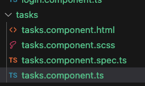

# **ReactJS for Angular Developers Part 3: Components and Presenting Data**

In the first part of this series, we added a form to the Login page. The form enabled a user to type their email address and password.


When the user presses Submit, the app checks the submitted credentials and authenticates the user. If the user’s credentials are valid, the application displays a message and navigates to the Task page. Now we will add a table to the page and display a list of tasks assigned to the user. Like the login form, the task table is an element within a component. This gives an opportunity to examine components in greater depth.


For now, the page only displays a table with basic task information. In future installments, we will create the functionality to add, edit, and delete tasks. As with Part 2, I have simplified the process of building the page by providing a list of tasks in a Javascript file. All the files referenced in this article, and the sample React and Angular code are available from GitHub.

## **Angular Components and Data Presentation**

An Angular component is a TypeScript file that includes three things. The first of these is a set of references to framework modules and other application resources.

```javascript
import { Component, OnInit } from '@angular/core';
import { RouterLink } from '@angular/router';
import { CommonModule } from '@angular/common';
import { Tasks } from '../data/tasks';
```

The second is an @Component directive that defines component-specific metadata, such as the component’s selector (name) and the component modules it imports. It also includes references to the component template and template-specific styling. The component template can be the component's HTML code and Angular directive, or it can be a link to a file. Likewise, component styling can be either style-sheet code or a link to a component stylesheet.

```javascript
@Component({
 selector: 'app-tasks',
 standalone: true,
 imports: [
   CommonModule,
   RouterLink
 ],
 templateUrl: './tasks.component.html',
 styleUrl: './tasks.component.scss'
})
```

In this example, the @Component directive references the .html and .scss files that were generated with the Angular CLI’s ng generate command. This command saves these files to a folder and generates a .spec.ts for running component tests.



The final and largest part of the component is the component class. The class declares internal and initializes class variables, a constructor for injecting dependencies, and methods. The injected dependencies are usually services that provide frequently used features.

```javascript
export class TasksComponent implements OnInit {
  tasks:any = Tasks;
  tableData:any = null
  showNav: boolean = false;
  tableCols: any = ['name','description','added','updated', 'status'];
  currentYear!: number;
  user:any = null;
  constructor() { }
  ngOnInit(): void {}
 }
}
```

Frequently, the class implements lifecycle events. Here the component class implements the ngOnInit lifecycle method. This method is invoked when the component is initialized and retrieves the authenticated user profile from the browser’s session storage. It also retrieves the list of tasks and applies a filter to display only the tasks assigned to the current user.

```javascript
ngOnInit(): void {
   this.user = JSON.parse(sessionStorage.getItem('user') || '{}');
   this.tableData = this.tasks.filter((task:any) => 
   task.user === this.user.userName
   );
}
```

The user tasks are displayed in the component’s template. In this case, the template is a .html file.

```html
<div class="container" >
 <h1>Tasks</h1>
 <table>
   <thead>
    <tr><th *ngFor="let col of tableCols" scope="col">{{col}}</th></tr>
   </thead>
   <tbody>
    <tr *ngFor="let item of tableData">
     <td *ngFor="let col of tableCols">{{item[col]}}</td>
    </tr>
   </tbody>
  </table>
  <p><a routerLink="/login">Go to login</a></p>
</div>
```

Most of the elements in the component template are standard, static HTML. While other elements, such as the table header and table body include a mixture of HTML with Angular templates and template expressions. For example, the following line generates the table’s header row and displays the name of each column.

```html
<th *ngFor="let col of tableCols" scope="col">{{col}}</th>
```

The first \<th\> tag includes an \*ngFor directive that iterates through an array of column names. The double set of braces is a template directive that interpolates the iterated text into the static HTML element.

## **React Components and Data Presentation**

As with Routing and Forms, React’s approach to building components and displaying data has many parallels to its Angular equivalent. Conversely, these parallels also highlight each framework’s contrasting approach.

Unlike Angular, there is no React CLI, so each time you create a new React component, you just create a new Javascript file in the appropriate location. As with Angular or any other Javascript framework, you declare all the referenced components at the top of the file. In this case, the userTasks file is the list of tasks and tableCols is the name of each table column.

```javascript
import { Link } from "react-router-dom";
import userTasks from "../data/tasks";
import tableCols from "../data/cols";
import "./_pages.css";
```

Following the references, you create the component definition. This is a single function that returns the entire component. This function highlights another key difference between Angular and React.

```javascript
const Tasks = () => {
 return (
   <div>
     <h1>Tasks</h1>
     <table>
       <thead>
         <tr>{tableCols.map((col) => (<th key={col}>{col}</th>))}</tr>
       </thead>
       <tbody>{userTasks.map((task) => (
        <tr key={task.id}>{tableCols.map((col) => (
          <td key={col}>{task[col.toLowerCase()]}</td>
        ))}</tr>
      ))}</tbody>
     </table>
     <p><Link to="/">Logout</Link></p>
   </div>
 );
};
export default Tasks;
```

In an Angular component, there is a clear separation between the presentational elements, component model, and code. Presentation elements use HTML and Angular directives, and the component model and computation use Typescript. In React, these elements are mixed together and written using React’s unique JavaScript XML (JSX) syntax. For example, the following displays the table's top row. Inside the \<tr\>\</tr\> tags there are a pair of {} braces. Within the braces, the code uses a .map method to iterate through the list of column names and display them.

```html
<tr>{tableCols.map((col) => (<th key={col}>{col}</th>))}</tr>
```

As we can see, both React and Angular have clear similarities in the ways they present data. However, each framework implements these principles in very different ways.
